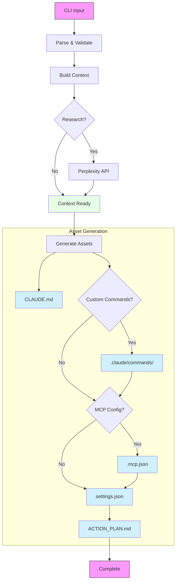

# cc-bootstrap: Claude Code Project Bootstrapper
[](https://pypi.org/project/ClaudeCodeBootstrap/)
[](https://pypi.org/project/ClaudeCodeBootstrap/)
[](https://opensource.org/licenses/MIT)
[](https://github.com/vinodismyname/cc-bootstrap/actions)

`cc-bootstrap` is a Python command-line tool that automates the setup of configuration files for [Anthropic's Claude Code](https://docs.anthropic.com/en/docs/claude-code/overview), an agentic AI coding assistant that runs in your terminal. This tool leverages Large Language Models (LLMs) to analyze user-provided project plans and existing codebase snippets, generating tailored configuration files to help you get the most out of Claude Code quickly.

By providing initial context and generating foundational assets, `cc-bootstrap` accelerates the adoption of Claude Code and helps establish best practices for its use in your projects.

## Table of Contents

- [Key Features](#key-features)
- [What `cc-bootstrap` Generates](#what-cc-bootstrap-generates)
- [Installation](#installation)
- [Configuration](#configuration)
- [Usage](#usage)
  - [CLI Options](#cli-options)
  - [Interactive Mode](#interactive-mode)
- [Workflow Overview](#workflow-overview)
- [Examples](#examples)
- [Troubleshooting](#troubleshooting)
- [Contributing](#contributing)
- [License](#license)

## Key Features

*   **LLM-Driven Configuration:** Utilizes LLMs (Anthropic API, AWS Bedrock) to generate context-aware configurations.
*   **Comprehensive Asset Creation:** Generates all essential files for Claude Code:
    *   `CLAUDE.md` (project context)
    *   Custom Commands (in `.claude/commands/`)
    *   `.mcp.json` (Model Context Protocol server configurations)
    *   `.claude/settings.json` (Claude Code settings)
    *   `ACTION_PLAN.md` (structured task plans)
*   **Multi-Provider Support:** Works with LLMs from Anthropic (via direct API) and AWS Bedrock.
*   **Project Analysis:** Can sample files from your existing project to build richer context for the LLM.
*   **Research Integration:** Optionally uses Perplexity API to fetch external information and enhance generated content.
*   **Claude Squad Ready:** Generates `ACTION_PLAN.md` suitable for both single-instance and multi-instance (Claude Squad) workflows.
*   **User-Friendly CLI:** Modern command-line interface built with Typer, featuring:
    *   An interactive mode (`-i` or `--interactive`) for guided setup.
    *   A dry-run mode (`--dry-run`) to preview changes.
    *   Options to force overwrite existing files or skip specific asset generation.
*   **Customizable:** Extensive CLI options and environment variable support for fine-tuning behavior.

## What `cc-bootstrap` Generates

`cc-bootstrap` creates the following files in your project directory, tailored to your project's needs:

*   **`CLAUDE.md`**: A Markdown file providing persistent, project-specific context to Claude Code. It includes project overview, tech stack, common commands, coding standards, and critical guidelines for Claude.
*   **`.claude/commands/`**: A directory containing custom slash commands (as `.md` files) for Claude Code. These commands automate common development tasks like code reviews, test generation, Git operations, and more.
*   **`.mcp.json`**: Configures Model Context Protocol (MCP) servers, allowing Claude Code to interact with external tools, APIs, and data sources (e.g., web search, databases).
*   **`.claude/settings.json`**: Sets default user preferences for Claude Code, including theme, telemetry, and crucially, `allowedTools` which can include permissions for the MCP tools defined in `.mcp.json`.
*   **`ACTION_PLAN.md`**: A structured Markdown document outlining a step-by-step plan for Claude Code to execute complex features or tasks. Supports generation for both single Claude instances and parallel "Claude Squad" workflows.

## Installation

### Prerequisites

*   Python 3.12 or higher.
*   `pip` or `uv`

### Steps

1.  **Install `cc-bootstrap`:**
    The tool will be available on PyPI.
    ```bash
    pip install cc-bootstrap
    ```
    or
    ```
    uvx cc-bootstrap

    ```


## Configuration

`cc-bootstrap` requires API keys for the LLM providers and optionally for Perplexity. These can be configured via environment variables or CLI options.

### Environment Variables

*   **Anthropic API:**
    *   `ANTHROPIC_API_KEY`: Your Anthropic API key.
*   **AWS Bedrock:**
    *   `AWS_ACCESS_KEY_ID`: Your AWS Access Key ID.
    *   `AWS_SECRET_ACCESS_KEY`: Your AWS Secret Access Key.
    *   `AWS_SESSION_TOKEN` (Optional): Your AWS Session Token.
    *   `AWS_REGION`: The AWS region for Bedrock (e.g., `us-west-2`).
    *   `AWS_PROFILE` (Optional): The AWS CLI profile to use.
*   **Perplexity API (Optional):**
    *   `PERPLEXITY_API_KEY`: Your Perplexity API key.

CLI options (see [Usage](#usage)) will override environment variables if both are provided.

## Usage

The primary command is `cc-bootstrap bootstrap`.

```bash
cc-bootstrap bootstrap [OPTIONS]
```

You can also run the tool in interactive mode:

```bash
cc-bootstrap --interactive
# or
cc-bootstrap bootstrap --interactive # or -i
```

### CLI Options

The `bootstrap` command accepts the following options:

*   `--project-path PATH` / `-p PATH`: Path to the target project folder. (Required in non-interactive mode)
*   `--project-plan-file PATH`: Path to the user's project specification/plan file (e.g., `plan.md`). (Required in non-interactive mode)
*   `--mcp-tools-config TEXT`: Path to a JSON/YAML file defining MCP tools, or a comma-separated string of tool names (e.g., `web_search,github`).
*   `--use-claude-squad / --no-use-claude-squad`: Enable Claude Squad guidance for `ACTION_PLAN.md`. (Default: no)
*   `--use-perplexity / --no-use-perplexity`: Use Perplexity API for research. (Default: no)
*   `--perplexity-api-key TEXT`: Perplexity API key. Overrides `PERPLEXITY_API_KEY` env var.
*   `--llm-provider [anthropic|bedrock]`: LLM provider to use. (Default: `anthropic`)
*   `--llm-model TEXT`: Specific LLM model ID. If not set, uses the provider's default (e.g., `claude-3-7-sonnet-20250219` for Anthropic, `us.anthropic.claude-3-7-sonnet-20250219-v1:0` for Bedrock).
*   `--api-key TEXT`: Anthropic API key. Overrides `ANTHROPIC_API_KEY` env var.
*   `--aws-region TEXT`: AWS region for Bedrock. Overrides `AWS_REGION` env var.
*   `--aws-profile TEXT`: AWS profile for Bedrock. Overrides `AWS_PROFILE` env var.
*   `--enable-thinking / --disable-thinking`: Enable/disable extended LLM thinking/reasoning capabilities (if supported by the model/provider). (Default: enabled, provider-dependent)
*   `--thinking-budget INTEGER`: Token budget for LLM thinking. (Default: 6000, provider-dependent)
*   `--force-overwrite / --no-force-overwrite`: Overwrite existing configuration files. (Default: no)
*   `--skip-commands / --generate-commands`: Skip custom commands generation. (Default: generate)
*   `--skip-mcp-config / --generate-mcp-config`: Skip MCP config (`.mcp.json`) generation. (Default: generate)
*   `--dry-run / --execute-run`: Simulate run without writing any files. (Default: execute)
*   `--verbose` / `-v`: Increase output verbosity for debugging.
*   `--interactive` / `-i`: Run in interactive mode, prompting for configuration values.
*   `--version` / `-V`: Show version and exit.
*   `--help`: Show help message and exit.

The global `cc-bootstrap` command also accepts `--interactive` (`-i`), `--verbose` (`-v`), and `--version` (`-V`).

### Interactive Mode

Running `cc-bootstrap --interactive` or `cc-bootstrap bootstrap -i` will guide you through the configuration options with prompts. This is recommended for first-time users or when you want to explore different settings. You can choose between "Quick Setup" (uses sensible defaults and CLI overrides) and "Advanced Setup" (prompts for all options).

## Workflow Overview



`cc-bootstrap` follows these general steps:

1.  **Initialization & Input:** Parses CLI arguments (or uses interactive prompts) and sets up logging. Key inputs are the project path and the project plan file.
2.  **Validation:** Checks the existence and accessibility of the project path and plan file. It can offer to create them if they are missing (especially in interactive mode).
3.  **Build Project Context:**
    *   Reads the content of the user-provided project plan file.
    *   Analyzes the specified project directory (`--project-path`) to understand its structure.
    *   Samples key files (e.g., `README.md`, `package.json`, source files) from the project to provide the LLM with concrete examples of existing code and conventions.
4.  **(Optional) Research with Perplexity API:**
    *   If `--use-perplexity` is enabled and an API key is provided:
        *   An LLM generates targeted research questions based on the project plan and file samples.
        *   These questions are sent to the Perplexity API to gather external knowledge (e.g., best practices for specific technologies, common pitfalls).
        *   The research insights are formatted and added to the context for subsequent generation steps.
5.  **Generate `CLAUDE.md`:** An LLM uses the aggregated context (project plan, file samples, and optional research insights) to create a comprehensive `CLAUDE.md` file. This file serves as the primary guidance document for Claude Code within the project.
6.  **(Conditional) Generate Custom Commands:** If not skipped (`--skip-commands` is false), an LLM generates a set of `.md` files in the `.claude/commands/` directory. These files define custom slash commands for Claude Code, tailored to common development tasks relevant to the project type.
7.  **(Conditional) Generate `.mcp.json` (MCP Configuration):** If not skipped (`--skip-mcp-config` is false), an LLM suggests and configures MCP (Model Context Protocol) servers based on the project context and any user-specified tools (from `--mcp-tools-config`). The output is saved to `.mcp.json`.
8.  **Generate `.claude/settings.json`:** A default `settings.json` file is created (or an existing one is used as a base if not overwriting). It's then updated to include `allowedTools` permissions for any MCP tools configured in the newly generated `.mcp.json`.
9.  **Generate `ACTION_PLAN.md`:** An LLM creates a detailed `ACTION_PLAN.md`. If `--use-claude-squad` is enabled, the plan is structured to facilitate parallel work by multiple Claude instances. Otherwise, a plan for a single instance is generated.
10. **Output Summary:** Displays a summary of the generated assets and their status (e.g., created, skipped, error).

Throughout this process, `cc-bootstrap` uses Jinja2 templates to construct prompts for the LLM, ensuring consistent and effective interaction.

## Examples

1.  **Basic Bootstrap (Anthropic, interactive):**
    ```bash
    cc-bootstrap --interactive
    ```
    Follow the prompts. Ensure `ANTHROPIC_API_KEY` is set or provide it when prompted.

2.  **Bootstrap for an existing project (AWS Bedrock):**
    ```bash
    export AWS_REGION="us-east-1"
    # Ensure AWS credentials (keys/profile) are configured

    cc-bootstrap bootstrap \
        --project-path ./my-existing-node-project \
        --project-plan-file ./docs/project_spec.md \
        --llm-provider bedrock \
        --llm-model anthropic.claude-3-haiku-20240307-v1:0 \
        --mcp-tools-config "web_search,github"
    ```

3.  **Dry run with Perplexity research and Claude Squad plan:**
    ```bash
    cc-bootstrap bootstrap \
        -p ./my-python-api \
        --project-plan-file ./README.md \
        --use-perplexity \
        --perplexity-api-key "YOUR_PPLX_KEY" \
        --use-claude-squad \
        --skip-commands \
        --dry-run \
        -v
    ```

4.  **Using a specific Anthropic model and forcing overwrite:**
    ```bash
    cc-bootstrap bootstrap \
        -p ./my-new-project \
        --project-plan-file ./plan.txt \
        --llm-provider anthropic \
        --llm-model claude-3-5-sonnet-20241022 \
        --api-key "sk-ant-..." \
        --force-overwrite
    ```

## Troubleshooting

*   **API Key Errors:**
    *   Ensure the correct environment variables (`ANTHROPIC_API_KEY`, AWS credentials, `PERPLEXITY_API_KEY`) are set and valid.
    *   Alternatively, pass keys directly via CLI options (e.g., `--api-key`).
    *   Check for typos or restrictions on your API key.
*   **Permission Denied:**
    *   Ensure `cc-bootstrap` has write permissions for the project directory and its subdirectories.
    *   If creating new files/directories, check parent directory permissions.
*   **LLM Provider Errors:**
    *   Verify the model ID is correct for the selected provider.
    *   Check the provider's status page for outages.
    *   Rate limits might be encountered; try again later or check your provider plan.
*   **File Not Found (Project Plan):**
    *   Ensure the path provided via `--project-plan-file` is correct. The tool can create an empty one if it doesn't exist and you confirm in interactive mode.
*   **Python Version:**
    *   `cc-bootstrap` requires Python 3.12+. Check your version with `python3 --version`.
*   **Dependencies:**
    *   If you encounter import errors, ensure all dependencies were installed correctly, preferably in a virtual environment.
*   **Verbose Output:**
    *   Use the `--verbose` or `-v` flag for more detailed logs, which can help pinpoint issues.
    *   Example: `cc-bootstrap bootstrap -p . --project-plan-file plan.md -v`


