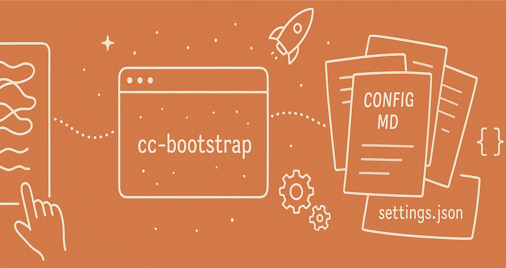
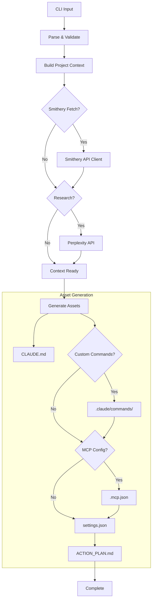

# cc-bootstrap: Claude Code Project Bootstrapper
[](https://pypi.org/project/cc-bootstrap/)
[](https://pypi.org/project/cc-bootstrap/)
[](https://opensource.org/licenses/MIT)

`cc-bootstrap` is a Python command-line tool that automates the setup of configuration files for [Anthropic's Claude Code](https://docs.anthropic.com/en/docs/claude-code/overview), an agentic AI coding assistant that runs in your terminal. This tool leverages Large Language Models (LLMs) to analyze user-provided project plans and existing codebase snippets, generating tailored configuration files to help you get the most out of Claude Code quickly.

By providing initial context and generating foundational assets, `cc-bootstrap` accelerates the adoption of Claude Code and helps establish best practices for its use in your projects.

## Table of Contents

- [Key Features](#key-features)
- [What `cc-bootstrap` Generates](#what-cc-bootstrap-generates)
- [Installation](#installation)
- [Configuration](#configuration)
- [Usage](#usage)
  - [CLI Options](#cli-options)
  - [Interactive Mode](#interactive-mode)
- [Workflow Overview](#workflow-overview)
- [Examples](#examples)
- [Troubleshooting](#troubleshooting)
- [Contributing](#contributing)
- [License](#license)

## Key Features

*   **LLM-Driven Configuration:** Utilizes LLMs (Anthropic API, AWS Bedrock) to generate context-aware configurations.
*   **Smithery Integration:** Discovers and configures MCP (Model Context Protocol) servers using the [Smithery Registry](https://registry.smithery.ai), providing robust and standardized tool access for Claude Code.
*   **Comprehensive Asset Creation:** Generates all essential files for Claude Code:
    *   `CLAUDE.md` (project context, including details of Smithery-configured MCP tools)
    *   Custom Commands (in `.claude/commands/`, aware of available MCP tools)
    *   `.mcp.json` (Model Context Protocol server configurations, primarily driven by Smithery)
    *   `.claude/settings.json` (Claude Code settings, with permissions for configured MCP tools)
    *   `ACTION_PLAN.md` (structured task plans)
*   **Multi-Provider Support:** Works with LLMs from Anthropic (via direct API) and AWS Bedrock.
*   **Project Analysis:** Can sample files from your existing project to build richer context for the LLM.
*   **Research Integration:** Optionally uses Perplexity API to fetch external information and enhance generated content.
*   **Claude Squad Ready:** Generates `ACTION_PLAN.md` suitable for both single-instance and multi-instance (Claude Squad) workflows.
*   **User-Friendly CLI:** Modern command-line interface built with Typer, featuring:
    *   An interactive mode (`-i` or `--interactive`) for guided setup.
    *   A dry-run mode (`--dry-run`) to preview changes.
    *   Options to force overwrite existing files or skip specific asset generation.
*   **Customizable:** Extensive CLI options and environment variable support for fine-tuning behavior.
*   **Efficient Command Generation:** Generates all custom commands in a single, optimized LLM call.

## What `cc-bootstrap` Generates

`cc-bootstrap` creates the following files in your project directory, tailored to your project's needs:

*   **`CLAUDE.md`**: A Markdown file providing persistent, project-specific context to Claude Code. It includes project overview, tech stack, common commands, coding standards, critical guidelines for Claude, and a list of available MCP tools configured via Smithery.
*   **`.claude/commands/`**: A directory containing custom slash commands (as `.md` files) for Claude Code. These commands automate common development tasks like code reviews, test generation, Git operations, and more, and can be generated with awareness of available MCP tools.
*   **`.mcp.json`**: Configures Model Context Protocol (MCP) servers, allowing Claude Code to interact with external tools, APIs, and data sources. This file is primarily populated based on server configurations fetched from the Smithery Registry.
*   **`.claude/settings.json`**: Sets default user preferences for Claude Code, including theme, telemetry, and crucially, `allowedTools` which can include permissions for the MCP tools defined in `.mcp.json`.
*   **`ACTION_PLAN.md`**: A structured Markdown document outlining a step-by-step plan for Claude Code to execute complex features or tasks. Supports generation for both single Claude instances and parallel "Claude Squad" workflows.

## Installation

### Prerequisites

*   Python 3.12 or higher.
*   `pip` or `uv`

### Steps

1.  **Install `cc-bootstrap`:**
    The tool will be available on PyPI.
    ```bash
    pip install cc-bootstrap
    ```
    or
    ```
    uvx cc-bootstrap

    ```


## Configuration

`cc-bootstrap` requires API keys for the LLM providers and optionally for Perplexity and Smithery. These can be configured via environment variables or CLI options.

### Environment Variables

*   **Anthropic API:**
    *   `ANTHROPIC_API_KEY`: Your Anthropic API key.
*   **AWS Bedrock:**
    *   `AWS_ACCESS_KEY_ID`: Your AWS Access Key ID.
    *   `AWS_SECRET_ACCESS_KEY`: Your AWS Secret Access Key.
    *   `AWS_SESSION_TOKEN` (Optional): Your AWS Session Token.
    *   `AWS_REGION`: The AWS region for Bedrock (e.g., `us-west-2`).
    *   `AWS_PROFILE` (Optional): The AWS CLI profile to use.
*   **Perplexity API (Optional):**
    *   `PERPLEXITY_API_KEY`: Your Perplexity API key.
*   **Smithery API (Optional, for MCP server discovery):**
    *   `SMITHERY_API_KEY`: Your Smithery API key.

CLI options (see [Usage](#usage)) will override environment variables if both are provided.

## Usage

The primary command is `cc-bootstrap bootstrap`.

```bash
cc-bootstrap bootstrap [OPTIONS]
```

You can also run the tool in interactive mode:

```bash
cc-bootstrap --interactive
# or
cc-bootstrap bootstrap --interactive # or -i
```

### CLI Options

The `bootstrap` command accepts the following options:

*   `--project-path PATH` / `-p PATH`: Path to the target project folder. (Required in non-interactive mode)
*   `--project-plan-file PATH`: Path to the user's project specification/plan file (e.g., `plan.md`). (Required in non-interactive mode)
*   `--smithery-mcp-servers TEXT`: Comma-separated list of Smithery server names or search queries (e.g., 'owner/repo,exa,search term'). Used to fetch MCP server configurations from Smithery Registry.
*   `--smithery-api-key TEXT`: Smithery API key. Overrides `SMITHERY_API_KEY` env var.
*   `--use-claude-squad / --no-use-claude-squad`: Enable Claude Squad guidance for `ACTION_PLAN.md`. (Default: no)
*   `--use-perplexity / --no-use-perplexity`: Use Perplexity API for research. (Default: no)
*   `--perplexity-api-key TEXT`: Perplexity API key. Overrides `PERPLEXITY_API_KEY` env var.
*   `--llm-provider [anthropic|bedrock]`: LLM provider to use. (Default: `anthropic`)
*   `--llm-model TEXT`: Specific LLM model ID. If not set, uses the provider's default (e.g., `claude-3-7-sonnet-20250219` for Anthropic, `us.anthropic.claude-3-7-sonnet-20250219-v1:0` for Bedrock).
*   `--api-key TEXT`: Anthropic API key. Overrides `ANTHROPIC_API_KEY` env var.
*   `--aws-region TEXT`: AWS region for Bedrock. Overrides `AWS_REGION` env var.
*   `--aws-profile TEXT`: AWS profile for Bedrock. Overrides `AWS_PROFILE` env var.
*   `--enable-thinking / --disable-thinking`: Enable/disable extended LLM thinking/reasoning capabilities (if supported by the model/provider). (Default: enabled, provider-dependent)
*   `--thinking-budget INTEGER`: Token budget for LLM thinking. (Default: 6000, provider-dependent)
*   `--force-overwrite / --no-force-overwrite`: Overwrite existing configuration files. (Default: no)
*   `--skip-commands / --generate-commands`: Skip custom commands generation. (Default: generate)
*   `--skip-mcp-config / --generate-mcp-config`: Skip MCP config (`.mcp.json`) generation. (Default: generate)
*   `--dry-run / --execute-run`: Simulate run without writing any files. (Default: execute)
*   `--verbose` / `-v`: Increase output verbosity for debugging.
*   `--interactive` / `-i`: Run in interactive mode, prompting for configuration values.
*   `--version` / `-V`: Show version and exit.
*   `--help`: Show help message and exit.

The global `cc-bootstrap` command also accepts `--interactive` (`-i`), `--verbose` (`-v`), and `--version` (`-V`).

### Interactive Mode

Running `cc-bootstrap --interactive` or `cc-bootstrap bootstrap -i` will guide you through the configuration options with prompts. This is recommended for first-time users or when you want to explore different settings. You can choose between "Quick Setup" (uses sensible defaults and CLI overrides) and "Advanced Setup" (prompts for all options).

## Workflow Overview



`cc-bootstrap` follows these general steps:

1.  **Initialization & Input:** Parses CLI arguments (or uses interactive prompts) and sets up logging. Key inputs are the project path and the project plan file.
2.  **Validation:** Checks the existence and accessibility of the project path and plan file. It can offer to create them if they are missing (especially in interactive mode).
3.  **Build Project Context:**
    *   Reads the content of the user-provided project plan file.
    *   Analyzes the specified project directory (`--project-path`) to understand its structure.
    *   Samples key files (e.g., `README.md`, `package.json`, source files) from the project to provide the LLM with concrete examples of existing code and conventions.
4.  **(Optional) Fetch Smithery MCP Server Configurations:**
    *   If `--smithery-mcp-servers` is provided along with a `--smithery-api-key` (or `SMITHERY_API_KEY` env var):
        *   The tool queries the Smithery Registry for the specified server names or search terms.
        *   It fetches details, including connection information (HTTP, stdio, etc.) and tool schemas.
        *   This data is added to the context for generating `.mcp.json` and enriching `CLAUDE.md`.
5.  **(Optional) Research with Perplexity API:**
    *   If `--use-perplexity` is enabled and an API key is provided:
        *   An LLM generates targeted research questions based on the project plan and file samples.
        *   These questions are sent to the Perplexity API to gather external knowledge (e.g., best practices for specific technologies, common pitfalls).
        *   The research insights are formatted and added to the context for subsequent generation steps.
6.  **Generate `CLAUDE.md`:** An LLM uses the aggregated context (project plan, file samples, optional Smithery server details, and optional research insights) to create a comprehensive `CLAUDE.md` file. This file serves as the primary guidance document for Claude Code within the project and includes a section detailing available MCP tools configured via Smithery.
7.  **(Conditional) Generate Custom Commands:** If not skipped (`--skip-commands` is false), an LLM generates a set of `.md` files in the `.claude/commands/` directory using a single, optimized prompt. These files define custom slash commands for Claude Code, tailored to common development tasks relevant to the project type and can incorporate knowledge of available Smithery-configured MCP tools.
8.  **(Conditional) Generate `.mcp.json` (MCP Configuration):** If not skipped (`--skip-mcp-config` is false), the tool configures MCP (Model Context Protocol) servers in `.mcp.json`. This configuration is primarily based on data fetched from the Smithery Registry using `--smithery-mcp-servers`. The tool attempts to find the best match for specified server names or search terms and configures them using HTTP or stdio connection types provided by Smithery.
9.  **Generate `.claude/settings.json`:** A default `settings.json` file is created (or an existing one is used as a base if not overwriting). It's then updated to include `allowedTools` permissions for any MCP tools configured in the newly generated `.mcp.json`.
10. **Generate `ACTION_PLAN.md`:** An LLM creates a detailed `ACTION_PLAN.md`. If `--use-claude-squad` is enabled, the plan is structured to facilitate parallel work by multiple Claude instances. Otherwise, a plan for a single instance is generated.
11. **Output Summary:** Displays a summary of the generated assets and their status (e.g., created, skipped, error).

Throughout this process, `cc-bootstrap` uses Jinja2 templates to construct prompts for the LLM, ensuring consistent and effective interaction.

## Examples

1.  **Basic Bootstrap (Anthropic, interactive):**
    ```bash
    cc-bootstrap --interactive
    ```
    Follow the prompts. Ensure `ANTHROPIC_API_KEY` is set or provide it when prompted.

2.  **Bootstrap for an existing project (AWS Bedrock) with Smithery MCP servers:**
    ```bash
    export AWS_REGION="us-east-1"
    export SMITHERY_API_KEY="your_smithery_key"
    # Ensure AWS credentials (keys/profile) are configured

    cc-bootstrap bootstrap \
        --project-path ./my-existing-node-project \
        --project-plan-file ./docs/project_spec.md \
        --llm-provider bedrock \
        --llm-model anthropic.claude-3-haiku-20240307-v1:0 \
        --smithery-mcp-servers "anthropic/web-search,github/copilot-mcp"
    ```

3.  **Dry run with Perplexity research and Claude Squad plan, specifying a Smithery server by search term:**
    ```bash
    cc-bootstrap bootstrap \
        -p ./my-python-api \
        --project-plan-file ./README.md \
        --use-perplexity \
        --perplexity-api-key "YOUR_PPLX_KEY" \
        --smithery-mcp-servers "official web search" \
        --smithery-api-key "YOUR_SMITHERY_KEY" \
        --use-claude-squad \
        --skip-commands \
        --dry-run \
        -v
    ```

4.  **Using a specific Anthropic model and forcing overwrite:**
    ```bash
    cc-bootstrap bootstrap \
        -p ./my-new-project \
        --project-plan-file ./plan.txt \
        --llm-provider anthropic \
        --llm-model claude-3-5-sonnet-20241022 \
        --api-key "sk-ant-..." \
        --force-overwrite
    ```

## Troubleshooting

*   **API Key Errors:**
    *   Ensure the correct environment variables (`ANTHROPIC_API_KEY`, AWS credentials, `PERPLEXITY_API_KEY`, `SMITHERY_API_KEY`) are set and valid.
    *   Alternatively, pass keys directly via CLI options (e.g., `--api-key`, `--smithery-api-key`).
    *   Check for typos or restrictions on your API key.
*   **Permission Denied:**
    *   Ensure `cc-bootstrap` has write permissions for the project directory and its subdirectories.
    *   If creating new files/directories, check parent directory permissions.
*   **LLM Provider Errors:**
    *   Verify the model ID is correct for the selected provider.
    *   Check the provider's status page for outages.
    *   Rate limits might be encountered; try again later or check your provider plan.
*   **Smithery Errors:**
    *   Ensure your `SMITHERY_API_KEY` is correct and has access.
    *   Verify the server names or search terms passed to `--smithery-mcp-servers` are valid or likely to yield results in the Smithery Registry.
*   **File Not Found (Project Plan):**
    *   Ensure the path provided via `--project-plan-file` is correct. The tool can create an empty one if it doesn't exist and you confirm in interactive mode.
*   **Python Version:**
    *   `cc-bootstrap` requires Python 3.12+. Check your version with `python3 --version`.
*   **Dependencies:**
    *   If you encounter import errors, ensure all dependencies were installed correctly, preferably in a virtual environment.
*   **Verbose Output:**
    *   Use the `--verbose` or `-v` flag for more detailed logs, which can help pinpoint issues.
    *   Example: `cc-bootstrap bootstrap -p . --project-plan-file plan.md -v`